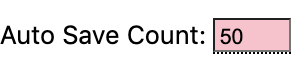

.. Documentation about using Phil's menu items

Phil's Menu items
=================
Menu items are found on the left-hand side of the page.

.. ### |auto-fill-puzzle| image:: images/Auto-Fill-Puzzle.png
.. |regular-expression-matching| image:: images/RegulAr-Expression-Matching.png

.. glossary ::

    |new-puzzle|
        Create a new puzzle.

    |open-puzzle|
        Brings up a previously saved puzzle.

    |export-as|
        Save the current puzzle in various formats:

	- **Phil puzzle** (.xw) is the standard format. 

          Note: If  |auto-save-count| is greater than zero, the puzzle
	  will be saved in this format after the specified number of
	  changes.

	- **Across Lite** (.puz) is the format used by `Across Lite <https://www.litsoft.com/across/alite/download/>`_
	- **Printable version** (.pdf) displays the blank grid along with clues
	- **NYT submission** displays a form suitable for submission
	  to the *New York Times*. It includes a blank grid, all clues
	  and a filled in grid.

    |quick-layout|
        Layout an empty grid that is either 15x15 or 21x21. Repeated
	requests for a quick layout selects from a small set of grid
	patterns. 

    |freeze-pattern|
        Freezes the pattern from structural changes (i.e., adding or
	removing black squares).

    |clear-white-squares|
        Clears answers in the white squares.

    |toggle-symmetry|
        Toggles whether the puzzle pattern must be symmetric.

    |toggle-recommended-answers|
        Toggles whether *all* answers matching a the puzzle pattern
	are displayed or only moderately- and highly-recommended ones
	are. See `Recommended Answers
	<recommendations.html#recommended-answers>`_  for more details.

    |regular-expression-matching|
        Constrain suggested answers to those meeting regular express
	patterns. See `Regular Expressions
	<regex.html#regular-expressions-in-phil>`_ for details.

    |check-duplicates|
        Check for duplicate answers. This reports on answers which are
	either exact duplicates or where an answer is found as a
	substring of another answer.

    |change-dictionary|
        Use another dictionary for suggesting answers.

    |undo|
        Undo changes you've made. See
	`Undo <undo.html#undoing-and-redoing-changes>`_ for details.

    |redo|
        Redo changes you've previously undone. See
	`Redo <undo.html#undoing-and-redoing-changes>`_ for details.

    |toggle-usage-assistance|
        Display assistance in using this application.
