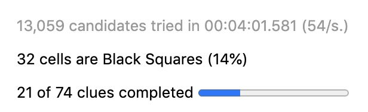
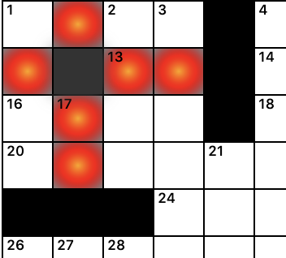

.. Documentation about using Phil's miscellaneous features

Miscellaneous Features
======================

Statistics
----------
Puzzle statistics are given in the lower right hand portion of the
page. It shows how many clues have been completed out of the total
number (and illustrates this by way of a bar graph). It also shows the
number of black squares and the proportion they comprise of the entire
number of squares in the puzzle. For example:

.. note:: Best practices recommend keeping the percentage of black
	  squares to no more than 16%.

Blocked Squares
---------------
A square is said to be "blocked" if a word of at least three letters
cannot be formed from it in both the horizontal and vertical
directions. If you place a black square such that it blocks other
squares, Phil will color these blocked squares. For instance, the
black square just to the left of 13 blocks six other squares.

